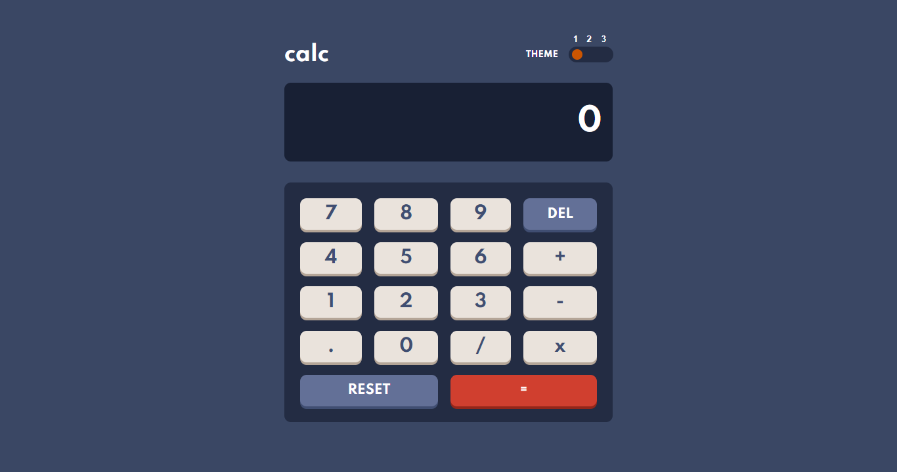

# Frontend Mentor - Calculator app solution

This is a solution to the [Calculator app challenge on Frontend Mentor](https://www.frontendmentor.io/challenges/calculator-app-9lteq5N29). Frontend Mentor challenges help you improve your coding skills by building realistic projects.

## Table of contents

- [Overview](#overview)
  - [The challenge](#the-challenge)
  - [Screenshot](#screenshot)
  - [Links](#links)
- [My process](#my-process)
  - [Built with](#built-with)
  - [What I learned](#what-i-learned)
  - [Continued development](#continued-development)
  - [Useful resources](#useful-resources)
- [Author](#author)
- [Acknowledgments](#acknowledgments)

## Overview

### The challenge

Users should be able to:

- See the size of the elements adjust based on their device's screen size
- Perform mathmatical operations like addition, subtraction, multiplication, and division
- Adjust the color theme based on their preference
- **Bonus**: Have their initial theme preference checked using `prefers-color-scheme` and have any additional changes saved in the browser

### Screenshot



### Links

- Solution URL: [FrontEndMentor Solution](https://www.frontendmentor.io/solutions/reactjs-styled-components-and-mathjs-n5x5yejul)
- Live Site URL: [Vercel Demo Link](https://calculator-app-black-xi.vercel.app/)

## My process

### Built with

- Semantic HTML5 markup
- CSS custom properties
- Flexbox
- CSS Grid
- [React](https://reactjs.org/) - JS library
- [Styled Components](https://styled-components.com/) - For styles

### What I learned

I learnt how to use ThemeProvider within Style Components to create the basis for theme switcher, and make it available globally to all the children components.

```js
import { ThemeProvider } from "styled-components";
import { themeOne, themeTwo, themeThree } from "./themes";

function App() {
  const [themeColor, setThemeColor] = useState(1);

  return (
    <ThemeProvider
      theme={
        themeColor === 1 ? themeOne : themeColor === 2 ? themeTwo : themeThree
      }
    >
      <StyledContainer className="App">
        <GlobalStyle />
        <InnerContainer themeColor={themeColor} setThemeColor={setThemeColor} />
      </StyledContainer>
    </ThemeProvider>
  );
}
```

### Continued development

In the future, I'll be adding the number formatting feature when multiple arithmetic operations are clicked within the same calculation. I've been struggling with it for a while, hence I found an acceptable solution, I'll update the app accordingly.

### Useful resources

- [Medium Article](https://medium.com/swlh/create-a-dark-mode-of-your-app-using-styled-components-a44bc5a59330) - This helped me for creating a dark mode with styled components; upon which I used to create the theme switcher.
- [YT Styled Components Dark Mode](https://www.youtube.com/watch?v=G00V4tRx1ME) - This is a helpful resource for those who are looking for a visual companion to the article above.

## Author

- Frontend Mentor - [@A.K.Afiq](https://www.frontendmentor.io/profile/akaahl)
- Twitter - [@a.k.a.a.h.l](https://twitter.com/akaahl1)

## Acknowledgments

I would like to express my thanks and acknowledgements to [Agata Liberska](https://www.frontendmentor.io/profile/AgataLiberska), as I derived the hover states of the keypad based on her color picks. And her solution, I think, is probably the best for this challenge. Check out her solution (here)[https://www.frontendmentor.io/solutions/calculator-app-html-css-js-tried-to-focus-on-accessibility-2yw2AOpoa].

Last but not least, thank you the FEM and its community for providing interesting challenges that pushes my skills and beyond.
